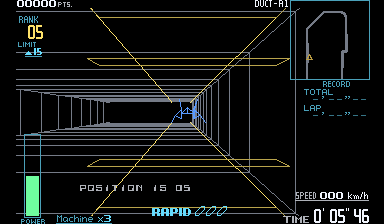

# Zero Racers Recompiled

A recompilation of **Zero Racers** for Virtual Boy, playable on Windows.
Built with [vbrecomp](https://github.com/mstan/vbrecomp) and
[recomp-ui](https://github.com/mstan/recomp-ui).

<p>
  
  
</p>

*Screenshots show the optional color mod. Original red graphics are the default.*

- Play with a keyboard or controller, with customizable controls.
- Adjust fullscreen, window size, filtering and audio through recomp-ui.
- Keep your progress with persistent saves and settings.
- Enable F-Zero-inspired colors: silver tunnels, distinct machines, colored
  menus and HUDs, and yellow repair areas, preserving the original wireframes.

## Play

1. Download the Windows ZIP from [Releases](https://github.com/mstan/ZeroRacersVirtualBoyRecomp/releases/latest).
2. Extract the entire ZIP and run **ZeroRacersVirtualBoyRecomp.exe**.
3. Choose **Browse For ROM**, select your extracted `.vb` file, and press **Play**.

You need your own supported ROM; none is included.

For color, open **Mods**, choose **Install .vbmod**, select the included
`zero-racers-full-color-0.2.1.vbmod`, and enable **Wireframe color**. Turn it off
to return to the original red graphics. The mod does not patch your ROM.

## Controls and settings

**Controller:** Select your connected controller in the launcher. The D-pad or
left stick steers; the right stick handles the Virtual Boy's right D-pad.
Face buttons, shoulders and Start/Select have ready-to-use defaults.

**Keyboard:** Arrow keys and WASD control the two D-pads. X/Z are A/B, Q/E are
L/R, Enter is Start, and Right Shift is Select. Hold Tab for turbo.

Use **Configure** to remap controls and **Settings** for display and audio.
Press **Escape** to open settings during play. Close the game normally to save.

When updating, close the game and extract the new ZIP into its folder. Keep
`vbrecomp.cfg`, `keybinds.ini`, `saves/` and `mods/` to retain your setup and progress.

## Supported ROM

Extract the ROM from its ZIP before selecting it. The launcher checks that it
matches this revision:

| Cartridge | Value |
|---|---|
| Revision | Zero Racers (Japan, USA) (En) (Switch Online) |
| Size | 1,048,576 bytes |
| CRC32 | `71553796` |
| SHA-256 | `47421cd82dfd414d042d2f7f9db51e657d414d4ddfa46887efb544029fa11ce7` |

## For developers

You need Windows 10/11 x64, Git, Python 3.11+ on PATH, MSYS2, and the supported
ROM. Install the build tools in an MSYS2 terminal:

```sh
pacman -S --needed mingw-w64-x86_64-gcc mingw-w64-x86_64-cmake mingw-w64-x86_64-ninja mingw-w64-x86_64-make mingw-w64-x86_64-SDL2
```

Then clone and build from PowerShell:

```powershell
git clone --recurse-submodules https://github.com/mstan/ZeroRacersVirtualBoyRecomp.git
Set-Location ZeroRacersVirtualBoyRecomp
.\tools\build.ps1 -Rom 'C:\Games\zero_racers.vb'
.\build\vbrecomp\runtime\ZeroRacersVirtualBoyRecomp.exe --launcher --rom 'C:\Games\zero_racers.vb'
```

For an existing clone, run `git submodule update --init --recursive` first.
The build script handles code generation and compilation. It expects MSYS2 at
`C:\msys64`; use `-Toolchain` or `-Python` for custom installation paths.

Add `-Build build-release -Production` to build the player version. To try the
color mod after a regular build, run `python tools/play-color.py`.

## License

See [LICENSE.md](LICENSE.md) for project licensing. Dependencies retain their
own licenses. Zero Racers and its artwork belong to Nintendo; see
[artwork attribution](assets/NOTICE.md).

---

<p align="center">
  <b>R.A.I.D. - Retro AI Development</b><br>
  A Discord for AI-assisted retro reverse engineering, decompilation and recompilation.
</p>

<p align="center">
  <a href="https://discord.gg/Ad9BwSzctP"></a>
</p>
