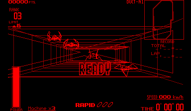

# Zero Racers Recompiled

Static V810-to-C recompilation of **Zero Racers** for Virtual Boy, using the
Japan/USA English Switch Online cartridge revision. Built with
[vbrecomp](https://github.com/mstan/vbrecomp) and
[recomp-ui](https://github.com/mstan/recomp-ui).

Includes a Virtual Boy launcher, ROM selection, persistent settings,
keyboard/controller configuration, an in-game settings menu, saves, and a
mod catalog. Version **0.0.3** includes the optional wireframe color mod,
with yellow repair lanes and beams and a single cool silver tunnel shade.
Original red graphics remain the default; color is explicitly opt-in.



**Status: playable initial release.** Menus and the starting HUD match the
independent Beetle reference pixel for pixel on the tested route. A separate
4,000-frame driving route passes CPU, memory, device, stereo image and audio
comparisons. These checks do not cover every course and mode.

[View the launcher](docs/launcher.png).

## For players

### Quick start

1. Download **ZeroRacersVirtualBoyRecomp-windows-x64.zip** from
   [Releases](https://github.com/mstan/ZeroRacersVirtualBoyRecomp/releases).
2. Extract everything, including `assets`, `licenses`, and `SDL2.dll`.
3. Run **ZeroRacersVirtualBoyRecomp.exe**, select **Browse For ROM**, choose your
   own extracted `.vb` file, and press **Play**. A ROM is not included.

For color, open **Mods**, choose **Install .vbmod**, select the included
`zero-racers-full-color-*.vbmod`, then enable **Wireframe color**.
Installing the package alone leaves color off. Mod 0.2.1 adds yellow repair
lanes and beams, with a single default cool silver tunnel shade. Disable the
feature to return to native red. See
[Mods and color](docs/MODS-AND-COLOR.md) for screenshots and details.

| Supported cartridge | Value |
|---|---|
| Revision | Zero Racers (Japan, USA) (En) (Switch Online) |
| Size | 1,048,576 bytes |
| CRC32 | `71553796` |
| SHA-256 | `47421cd82dfd414d042d2f7f9db51e657d414d4ddfa46887efb544029fa11ce7` |

Extract the cartridge from its ZIP before selecting it. The launcher verifies
its identity. Command-line launch is also supported:

```powershell
.\ZeroRacersVirtualBoyRecomp.exe --rom 'C:\Games\zero_racers.vb'
```

### Controls and settings

| Virtual Boy / action | Keyboard | Controller default |
|---|---|---|
| Left D-pad | Arrow keys | D-pad or left stick |
| Right D-pad | W / A / S / D | Right stick |
| A / B | X / Z | A / B |
| L / R | Q / E | LB / RB |
| Start / Select | Enter / Right Shift | Start / Back |
| Turbo | Tab | — |
| Settings menu | Escape | — |

Controller input uses SDL2 GameController, including detection and hot-plug
support. Choose your connected controller in the player selector once; the
bindings above are ready to use and the selection is saved. Button labels in
the table use Xbox names; SDL maps other recognized controller layouts.
Use **Configure** to rebind controls. Left-stick steering supplements the default
D-pad bindings and respects a changed or cleared binding. Choose **Keyboard**
in the player selector to use keyboard input. **Settings** controls window scale,
fullscreen, filtering, audio and volume. Escape opens settings during play;
closing the game window exits. `--stereo` displays both eyes vertically.

Settings live in `vbrecomp.cfg` beside the executable. Save RAM is written to
`saves/zero-racers.sav` on clean exit. Keep these files when updating. Mods are
managed through **Mods** and stored in `mods/`. The included color package is
optional and does not patch the ROM. The player build omits TCP debugging and CPU traces while retaining
interpreter fallback.

When updating from 0.0.1, close the game and extract the new ZIP into its folder.
Keep `vbrecomp.cfg`, `saves/` and `mods/`; the download contains no personal
settings or saves. The color mod requires the updated executable.

## For developers

### Clean setup

Prerequisites: Windows 10/11 x64, Git, Python 3.11+, and MSYS2 MinGW64 with GCC,
CMake, Ninja, make and SDL2. In an MSYS2 terminal:

```text
pacman -S --needed mingw-w64-x86_64-gcc mingw-w64-x86_64-cmake mingw-w64-x86_64-ninja mingw-w64-x86_64-make mingw-w64-x86_64-SDL2
```

Clone with access to this private repository, then build from PowerShell:

```powershell
git clone --recurse-submodules git@github.com:mstan/ZeroRacersVirtualBoyRecomp.git
Set-Location ZeroRacersVirtualBoyRecomp
.\tools\build.ps1 -Rom 'C:\Games\zero_racers.vb'
.\build\vbrecomp\runtime\ZeroRacersVirtualBoyRecomp.exe
```

For an existing clone, run `git submodule update --init --recursive` first.
Gitlinks pin exact dependencies; `vbrecomp.pin` and `recomp-ui.pin` mirror them.
The framework pin includes the Zero Racers parity work proposed in its PR.

The script verifies the ROM hash, regenerates cartridge C, configures the
native MinGW tools, builds and runs CTest. ROMs, generated code, builds, saves
and detailed captures are ignored. Override `-Python`, `-Toolchain`,
`-Framework`, `-Ui`, `-Oracle` or `-Build` for other installations/worktrees.
`-NoUi` omits the launcher. For a production player build:

```powershell
.\tools\build.ps1 -Rom 'C:\Games\zero_racers.vb' -Build build-release -Production
```

### Independent oracle and TCP tools

The optional Beetle oracle has its own CPU, devices and TCP server. Prepare
the pinned core with observation-only instrumentation, then rebuild:

```powershell
.\vbrecomp\tools\prepare-oracle.ps1 -Destination "$PWD\beetle-vb"
.\tools\build.ps1 -Rom 'C:\Games\zero_racers.vb'
```

The recomp uses TCP port 4390 and the oracle 4391 by default. Both support
`--paused`, input masks, exact frame advancement, registers, memory and
screenshots. The recomp also supports instruction stepping and breakpoints.
See [TCP protocol](vbrecomp/TCP.md) and [cosimulation](vbrecomp/docs/PARITY.md).

```powershell
python .\vbrecomp\tools\cosim.py compare `
  --runtime .\build\vbrecomp\runtime\ZeroRacersVirtualBoyRecomp.exe `
  --oracle .\build\vbrecomp\runtime\vb-beetle.exe `
  --rom 'C:\Games\zero_racers.vb' `
  --route .\tests\race-driving-route.json --out .\validation\driving
```

Use `gates` instead of `compare` for determinism, interpreter equivalence and
deliberate fault detection. For a foreground menu/start visual comparison:

```powershell
python -m pip install -r requirements-dev.txt
python .\tools\compare-menu-hud.py --rom 'C:\Games\zero_racers.vb'
```

The visual tool controls two owned windows and closes them when finished.
It supplies no driving input after selecting the race; the game's opening
sequence proceeds normally.

### Validation

- Driving: 39 checkpoints through frame 4,000 match all ten declared comparison
  planes, with 273 byte audits.
- Menus/start: 41 checkpoints through frame 2,400, zero differing pixels in
  both eyes; 16 menu/HUD presentation captures also match.
- The driving route executes 888,495,917 native instructions and 23,922 fallback
  instructions, approximately 99.997% native.
- TCP framing, pause/step/breakpoints, large transfers, backpressure,
  reconnection, trace rollover, keyboard input, in-game UI and saves pass.
- Mario's Tennis regression: 15 checkpoints through frame 1,000 match all ten
  planes. Framework CTest and Python suites pass.

View the [menu comparison](docs/menu-comparison.png) and
[starting HUD comparison](docs/hud-comparison.png).

### Architecture

Discovered V810 instructions are translated into C functions and compiled to
native x86-64 code. Default hybrid execution uses exact guest-PC dispatch;
uncovered ROM entries and RAM code use the interpreter, then return to native
dispatch. Both paths share live CPU and hardware state. No game routines are
replaced by host-side HLE. Beetle is used only for independent validation.

### Release

After production build and validation, commit the source and dependency pins:

```powershell
python .\tools\package-release.py --build build-release
git tag -a v0.0.3 -m 'Zero Racers Recompiled 0.0.3'
git push origin HEAD v0.0.3
gh release create v0.0.3 .\dist\ZeroRacersVirtualBoyRecomp-windows-x64.zip `
  .\dist\zero-racers-full-color-0.2.1.vbmod .\dist\SHA256SUMS.txt --draft --verify-tag `
  --title 'Zero Racers Recompiled 0.0.3' --notes-file .\docs\RELEASE-0.0.3.md
```

The ZIP's `build-info.json` records exact source commits, binary/package hashes,
and the disabled color default. Review the draft before publishing it.

## Optional color mod

The optional [wireframe color mod](docs/MODS-AND-COLOR.md) provides
cool silver tunnels, colored machines and NPCs, and dynamic HUD/menu accents with
exact native line and gap preservation. Version 0.0.2 includes this package,
disabled by default. Developers can build this checkout and run
`python tools/play-color.py` to open a separate preview profile with color enabled.
The mod remains experimental; later courses and every model variant have not
been individually reviewed.

## License

Build glue, tooling and documentation are covered by [LICENSE.md](LICENSE.md).
Framework, UI and bundled components retain their own licenses, included in
the ZIP. Zero Racers and its artwork belong to Nintendo. Provide your own
supported cartridge; no ROM is included. See [artwork attribution](assets/NOTICE.md).
