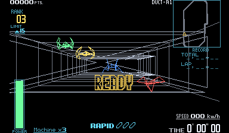
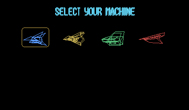
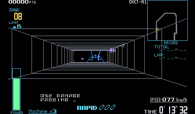
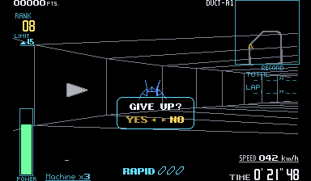

# Zero Racers wireframe color preview

The experimental full-color mod uses cool silver for the tunnel, blue/yellow/
green/coral for the four normal machine models, additional NPC colors, and
restrained HUD/menu colors. Preview **0.2.0** extends the first pass to changing
HUD glyphs, the give-up dialog, rotating minimap texels and model variants.
Every original black gap, line position, thickness, overlap and stereo offset is
preserved. Native intensity, including dim lines and brightness-register fades,
remains the maximum RGB channel of each colored pixel. There are no added
surfaces, bloom or geometry. The palette is an enhancement, not a claim about
Nintendo's intended colors.

## Try it

Build this branch with `tools/build.ps1`; the normal build also creates
`build/mod-packages/zero-racers-full-color-0.2.0.vbmod`. The renderer requires the
new executable on this branch; the original 0.0.1 release cannot activate it.

```powershell
python .\tools\play-color.py
```

The helper installs the package, enables **Wireframe color** and opens recomp-ui
using a separate `build/color-profile-0.2.0` for settings, saves and mod selections.
It chooses an unused diagnostic port so another preview can remain open, and
waits until the application closes. Supply `--rom` for a cartridge elsewhere.

Alternatively, install the `.vbmod` through the launcher's **Mods** page and
enable **Wireframe color**. **Tunnel tone** offers **Cool silver** and **Neutral
silver**. Turn the feature off in Mods (or the in-game settings) to restore native
red immediately. The ROM and saved game are never patched by the mod.

See the [launcher controls](color-mods.png), pictured with the first preview.









## How it follows the original drawing

Mario Tennis supplies the reference pattern: a game-owned, statically linked
`video.renderer` plugin, data-only `.vbmod` archive, editable named palette,
default-off feature and shared launcher controls. Its filled court/sky and
character material catalog are not used here.

Zero Racers draws its 3D wireframes directly into the framebuffer with V810
instructions. The renderer observes this pipeline without executing substitute
game logic:

| Stage | Verified cartridge location | Observation |
| --- | --- | --- |
| Model table | `FFF61080`, 16-byte records | Normal machine pairs 256/257, 258/259, 260/261, 262/263 share vertex data; 308 through 315 alias those pairs |
| Model edges | Store `FFF1403C`, descriptor in r6 | Attach the model identity to the edge being copied |
| Procedural tunnel edges | Builders `FFF1420E` through `FFF1495F` | Attach the tunnel role |
| Edge list | WRAM `05004220`, 8-byte entries | Host-only parallel tags survive vertex transformation/clipping |
| Stereo projection | Stores `FFF15012`, `FFF15150`, edge pointer r25 | Propagate the edge tag to each eye's actual line command |
| Line commands | WRAM `05005230`, 32-byte entries | Track projected commands without reconstructing their geometry |
| Native rasterizer | Stores inside `FFF13AD2` through `FFF13CE6`, command pointer r17 | Attach the tag only to framebuffer pixels the CPU actually changes |

The opening tunnel end uses model 59; side sections observed at the start use
models 34/35. Their model-copy path receives the tunnel palette too. Model tags
retain identity until presentation, where `models.txt` selects the palette role.
The normal machine pairs, their aliases and alternate menu models have matching
colors. Additional model families use teal, violet, amber, green and cyan;
unclassified geometry uses silver. Some machines deliberately use coral red.

The framework knows no Zero Racers addresses or colors. Its optional read-only
write observer returns an opaque presentation tag; framebuffer attribution is
updated alongside actual writes. Unchanged packed pixels keep their previous
owner, erased pixels lose attribution, and the native VIP overwrites attribution
when it draws. Both eyes and both framebuffer slots have separate metadata.

HUD/menu material masks use source atlas positions, CHR content hashes and
unflipped texel coordinates captured by the native renderer. Uncatalogued artwork
and newly exposed texels use readable white. During a race, the invariant POWER
label identifies the HUD from its displayed source artwork. Stable atlas regions
then give rank digits, LIMIT states, energy, boost, the minimap and give-up dialog
consistent colors as their content changes. Runtime coloring does not use
screen-coordinate bands or moving world indices. The authoring tool uses known
worlds only to label captured artwork. `materials.txt` contains color IDs and
lookup identities, not copied ROM bytes or original bitmap art.

## Scope and validation

The captured route covers the title, name entry, mode/machine/area/level menus,
Duct-A Beginner opening, NPC traffic, changing HUD text, give-up and resume.
Palette data covers additional model families beyond those visible on this
route. Later courses and every model variant have not been visually reviewed;
white artwork and silver geometry provide readable defaults until individually
mapped. The package remains experimental.

The [comparison report](color-validation.json) records 16 checkpoints through
frame 4500. CPU state, WRAM, VRAM and both raw eye images match the disabled
first-preview executable. Every presented pixel has the exact same visible/black
mask and maximum-channel intensity as the original. The unchanged framework's
previously passing source test checks packed writes, retained owners, erasure,
both eyes and display buffer lifetime. This is a focused route, not an exhaustive
gameplay or course validation.

To reproduce with your cartridge:

```powershell
python .\tools\color-capture.py --out .\validation\color-off --route .\tests\color-route.json --port 4692 --package .\build\mod-packages\zero-racers-full-color-0.2.0.vbmod
python .\tools\color-capture.py --out .\validation\color-on --route .\tests\color-route.json --port 4692 --package .\build\mod-packages\zero-racers-full-color-0.2.0.vbmod --enabled
python .\tools\validate-color.py .\validation\color-off .\validation\color-on
```

Captures are private owner-ROM data under ignored `validation/`. The commands own
and close their runtime instances. `tools/color-materials.py` rebuilds the source
material masks from `validation/color-sources`. Named RGB colors live in
`mods/full-color/palette.txt`. `models.txt` maps inclusive decimal model ranges
to those color names, one `first last color` row per range. Rebuild the package
after editing. Installed
versions are immutable, so use a fresh preview profile when changing development
package contents, and increment the package version before distributing an update.
